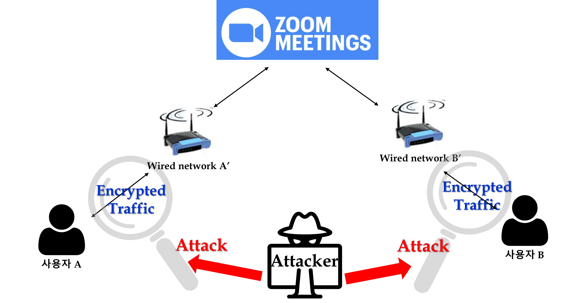
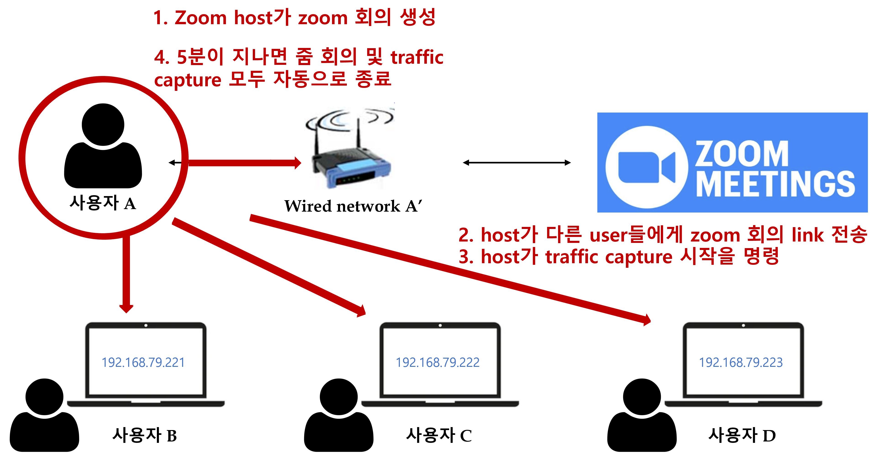

# Zoom_Website_Fingerprinting_Project
codes for zoom fingerprinting 
Automated pipeline for collecting network traffic traces on Zoom
Funded by ELTEC college of Engineering, Ewha Womans University 'College-Specific Research Scholarship for Academic Excellence'

### Project Overview

### Data Collection Architecture

